# Анекдотус

## Краткое описание идеи проекта
Анекдотус предоставляет пользователю возможность читать
отборные анекдоты. Создание личной библиотеки анекдотов на все
случаи жизни.

## Краткое описание предметной области
Предметной областью являются текстовые анекдоты.

## Краткое обоснование целесообразности и актуальности проекта
Юмор является неотъемлемой частью нашей жизни. Анекдотус даёт доступ
к его первостепенному источнику - анекдотам. 

## Краткое описание акторов(ролей)
Авторизованный пользователь может просматривать ленту анекдотов,
добавлять анекдоты в избранное.

Неавторизованный пользователь может просматривать ленту анекдотов.

Администратор площадки может загружать анекдоты на сайт(как текстом,
так и с помощью простого указания ссылки на первоисточник) и удалять
анекдоты.

## Use-Case диаграмма

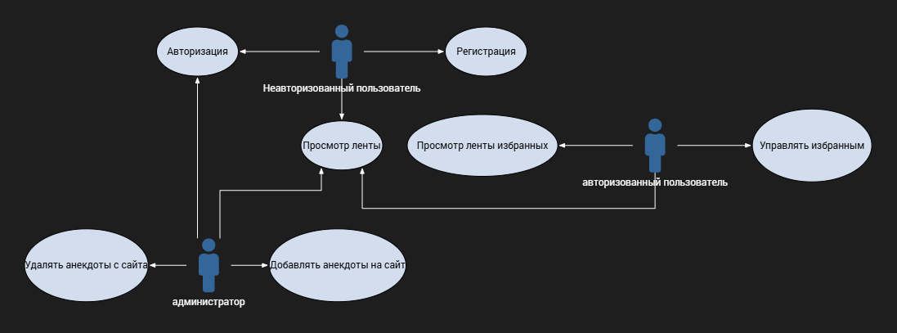

## ER-диаграмма сущностей 

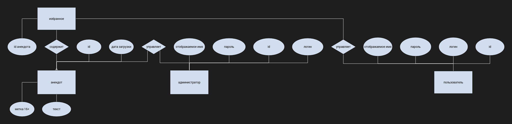

## ЦА

Целевая аудитория -- молодые люди, т.н. Зумеры.
Первый пользовательский портрет: подросток, молодой человек/девушка, который заходит на сайт в перерыве
на работе, утром за чашкой кофе, чтобы зарядится смешным контентом, и иметь чем поделиться с коллегами.

Второй пользовательский портрет: человек в возрасте 18-35 лет, который будет администратором
площадки. Ему нравится делать юмористический контент, выдумывать анекдоты, собирать лучшие с интернета,
перерабатывать и адаптировать.

## Пользовательские сценарии

Неавторизованному пользователю доступны просмотр ленты, авторизация и регистрация.

Авторизованный пользователь может добавлять или удалять анекдоты 
из избранного, просматривать ленту и избранное. 
Также пользователь может прервать сессию, выйдя из аккаунта.

Администратор может просматривать ленту. Ему доступно отдельное
меню, где он может добавить анекдот, вручную напечатав или вставив
его текст, или же вставкой ссылки на анекдот из интернета. В случае
если ссылка будет вести на один из сайтов, для которых создан парсер,
то ссылка автоматически распарсится и анекдот попадёт в ленту.
В противном случае администратору высветится предупреждение, что 
данный сайт не поддерживается.
Перед добавлением на сайт каждый анекдот проверяется на наличие 
ненормативной лексики. В случае её обнаружения анекдоту присваивается
пометка 18+.
Также администратор имеет возможность удалять с сайта любые анекдоты и редактировать их.
Также администратор может прервать сессию, выйдя из аккаунта.

## Формализация ключевых бизнес процессов

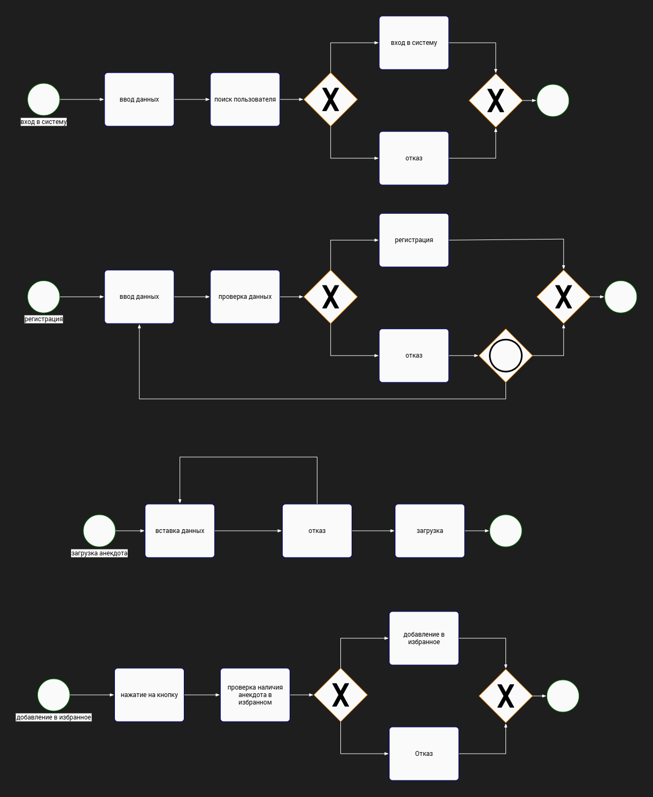

# Описание типа приложения и выбранного технологического стека
Тип приложения: Web SPA

Язык программирования: TypeScript

Компонентный фреймворк: Vue

База данных: PostgreSQL

# Диаграмма базы данных

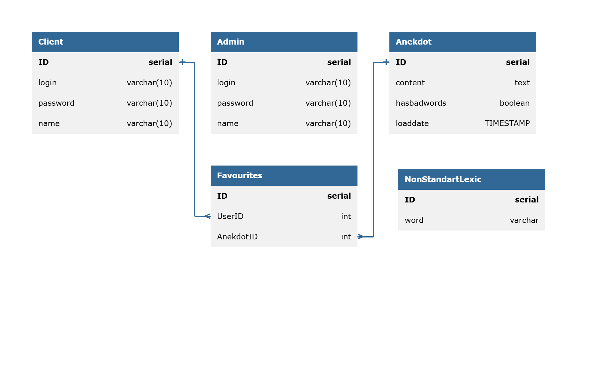

# Верхнеуровневое разбиение на компоненты
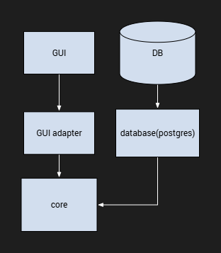

# UML диаграмма классов для двух отдельных компонентов - компонента доступа к данным и компонента с бизнес-логикой
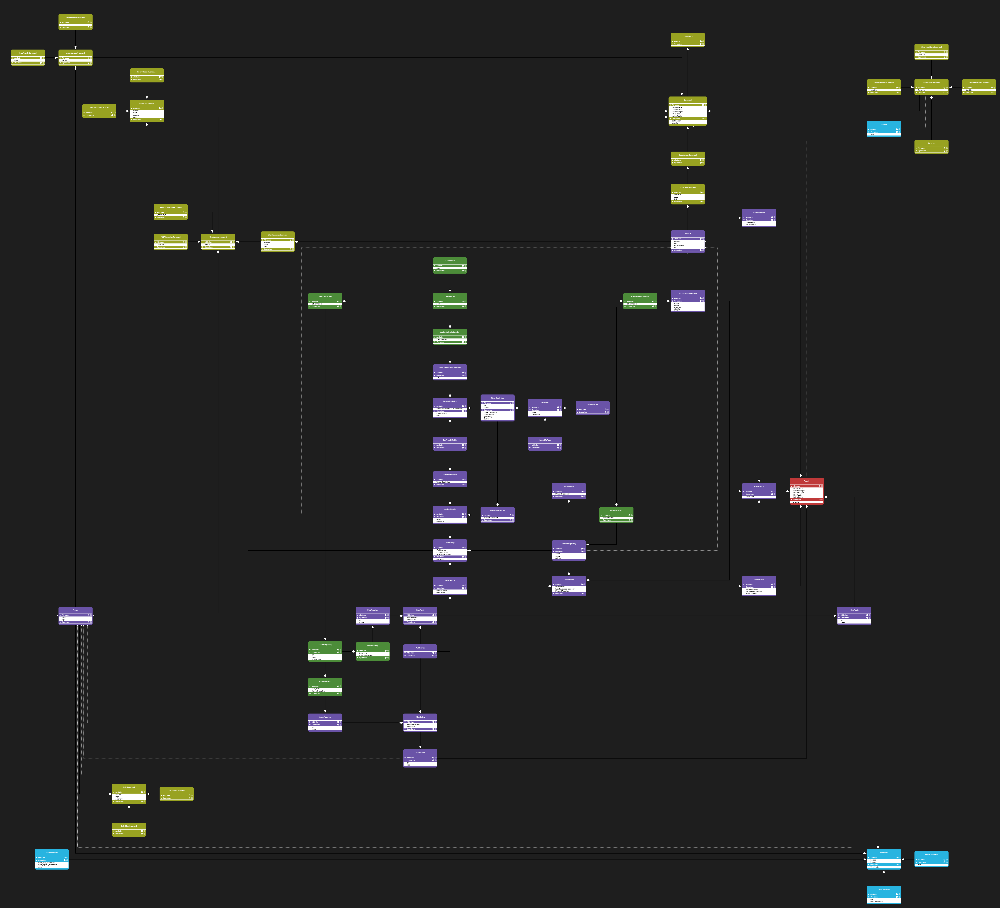

# Экраны WEB-приложения

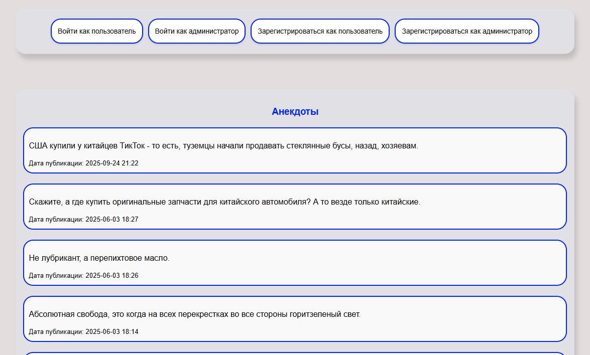
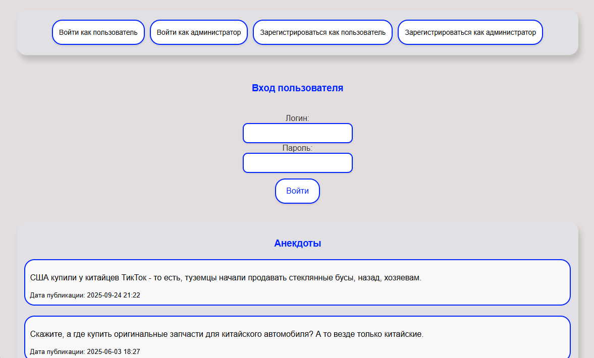
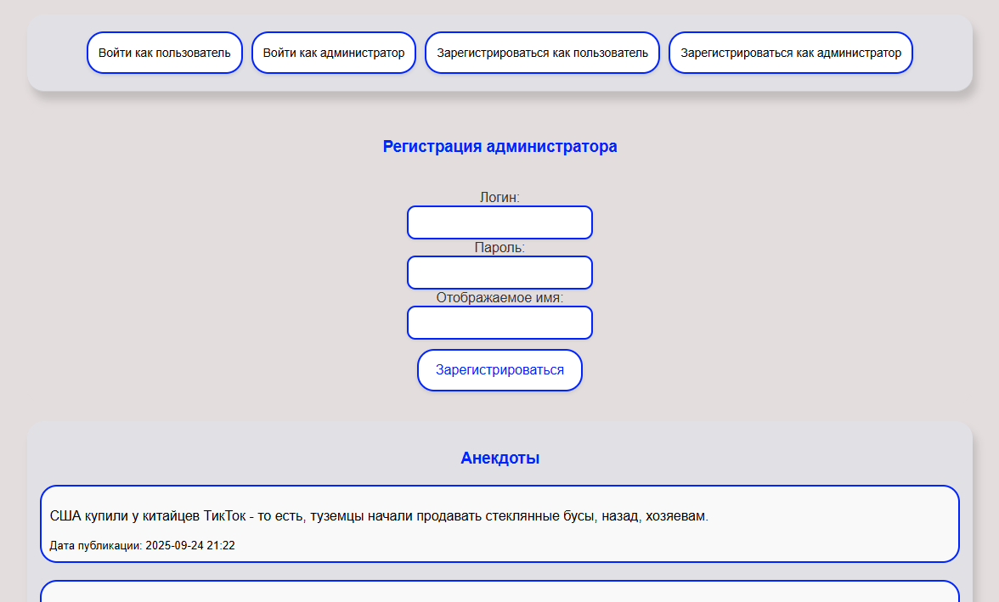
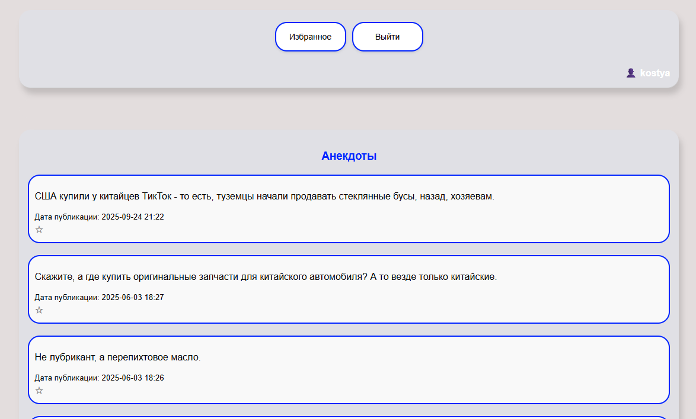
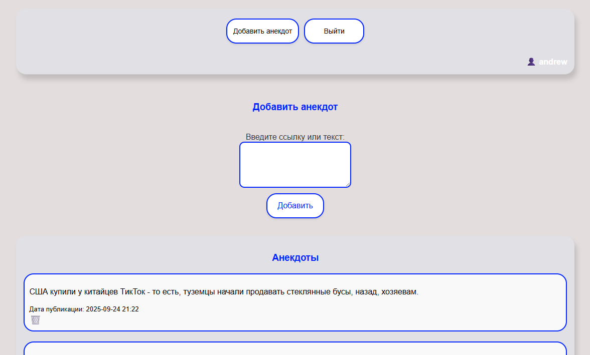
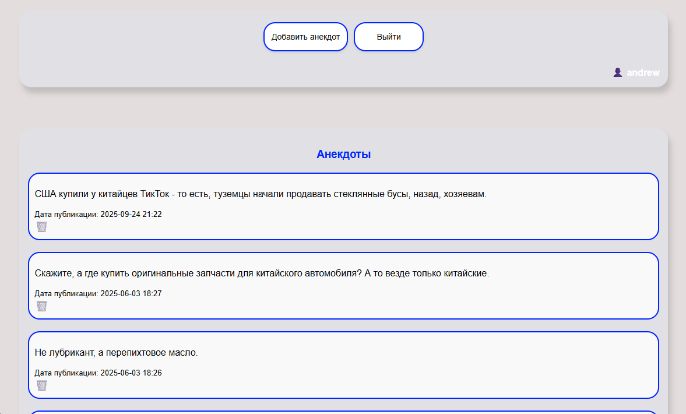